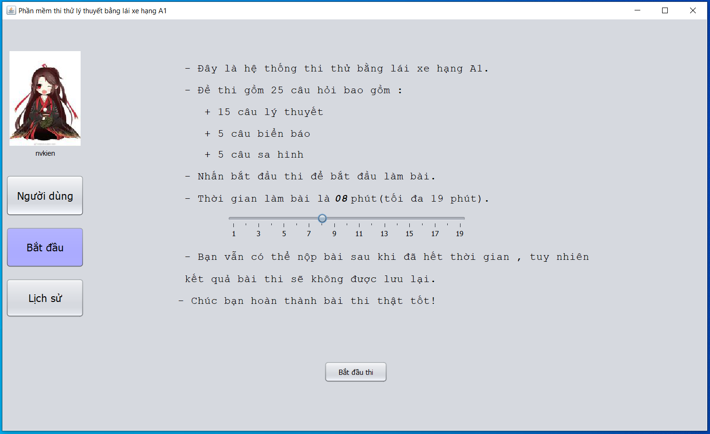
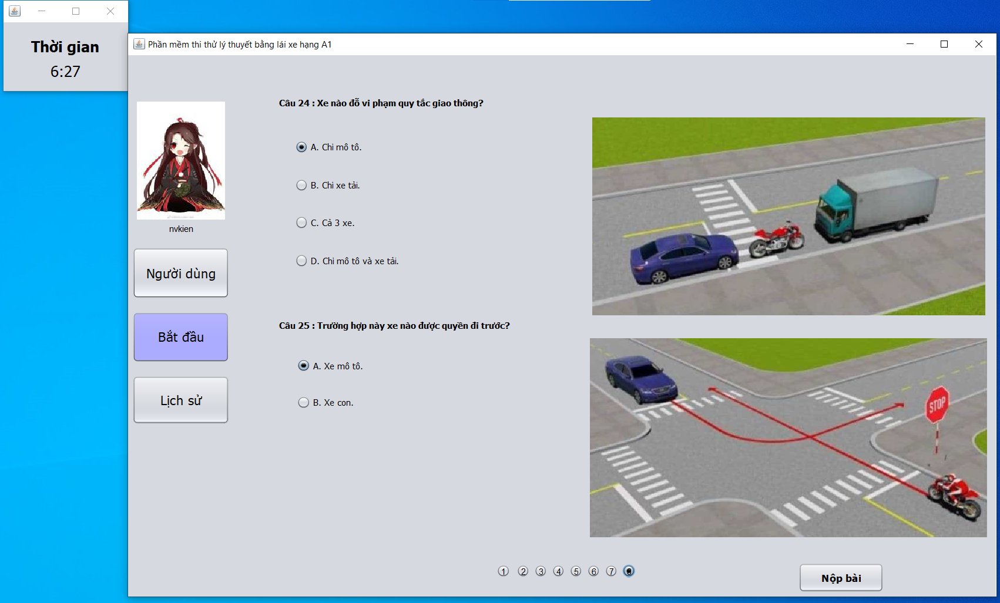
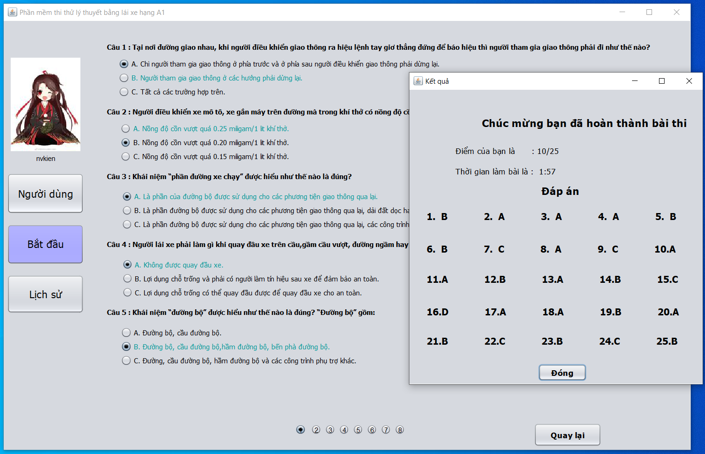
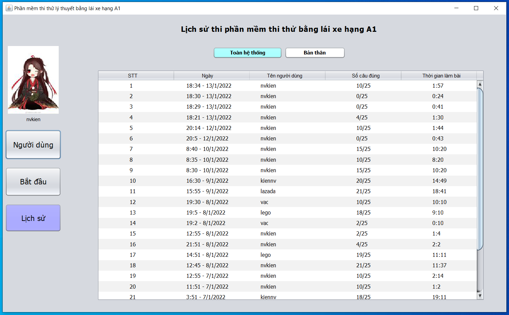

## Project thi thử trắc nghiệm bằng lái xe hạng A1
- Chương trình giúp mọi người có thể ôn luyện kiến thức trước kỳ thi lấy bằng lái xe hạng A1.
- Sử dụng ngôn ngữ java (jdk14).
## Sinh viên thực hiện
- Lê Hoàng Anh - N19DCCN005.
- Nguyễn Văn Kiên - N19DCCN077.
## Hướng dẫn cài đặt
- Dowload source code về và giải nén lần.
- Bạn cần sử dụng phiên bản jdk 14 trở lên.
- Nhấn Run Project để chạy chương trình hoặc chạy file userLogin.java .
- Nếu bị lỗi font trong eclipse : Windows -> Preferences -> General -> Workspace -> Text file encoding -> Other -> UTF8.
## Hướng dẫn thi
- Bạn đăng nhập tài khoản, nếu chưa có tài khoản thì tiến hành đăng ký tài khoản trước.
- Nhấn bắt đầu để thi
## Một số hình ảnh

